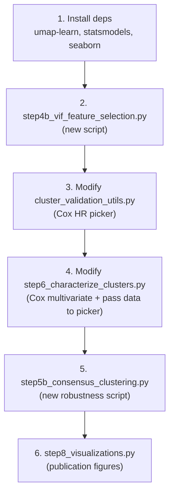

# Improve GBM Pipeline: VIF Feature Selection, Cox HR Labeling, Consensus Clustering, Multivariate Cox

## Problem Summary

The professor identified critical scientific flaws in the pipeline. We're fixing four specific issues — all using only the UCSF dataset with 70/30 internal split. Steps 3–7 already run and produce outputs successfully.

---

## User Review Required

> [!IMPORTANT]
> **70 features → severe multicollinearity.** Step 5 currently clusters on 70 features, many of which are highly correlated raw voxel counts. VIF filtering will aggressively reduce this. I propose a VIF threshold of 5 (standard), which may drop features to ~15–20. If you want to keep more features, tell me a different threshold.

> [!IMPORTANT]
> **Cox-based HR labeling replaces the `+0.25 temporal bonus`.** The current `pick_high_risk_cluster()` function manually injects a temporal bias. The new approach fits a Cox model with cluster dummies — the cluster with the worst hazard ratio is the high-risk group, chosen entirely by data.

> [!WARNING]
> **New dependencies needed.** We need to install: `umap-learn`, `statsmodels`, `seaborn`. These are standard scientific Python packages.

---

## Proposed Changes

### Dependency Installation

```bash
pip install umap-learn statsmodels seaborn
```

---

### New Script: VIF Feature Selection

#### [NEW] [step4b_vif_feature_selection.py](file:///c:/Users/Husain/Documents/AIml%20sideproject/GBM%20multi%20model/scripts/step4b_vif_feature_selection.py)

Runs **after Step 4, before Step 5**. Takes the train clustering features, computes VIF for each feature, and iteratively drops the feature with the highest VIF until all remaining features have VIF ≤ threshold (default 5).

**What it does:**
1. Load `ucsf_train_clustering_features_step4.csv` and `ucsf_test_clustering_features_step4.csv`
2. Compute VIF on train features (excluding binary/one-hot columns — those are not meaningful for VIF)
3. Iteratively drop highest VIF feature until all VIF ≤ threshold
4. Save filtered train/test feature CSVs and a VIF report
5. Save a JSON metadata file that downstream steps can read

**Key outputs:**
- `outputs/step4b/ucsf/ucsf_train_clustering_features_step4b.csv`
- `outputs/step4b/ucsf/ucsf_test_clustering_features_step4b.csv`
- `outputs/step4b/ucsf/ucsf_step4b_vif_report.csv` — shows each feature's VIF and whether it was kept/dropped
- `outputs/step4b/ucsf/ucsf_step4b_metadata.json`

---

### Fix Step 6: Replace Rule-Based High-Risk Labeling with Cox HR

#### [MODIFY] [cluster_validation_utils.py](file:///c:/Users/Husain/Documents/AIml%20sideproject/GBM%20multi%20model/scripts/cluster_validation_utils.py)

Replace `pick_high_risk_cluster()` (lines 112–127). Current code uses a hardcoded composite score with `+0.25 temporal bonus`. New code:

1. Fit a `lifelines.CoxPHFitter` on cluster dummies (one-hot encoded cluster labels) + OS + event columns
2. The cluster with the **highest hazard ratio** (worst survival) is labeled high-risk
3. If Cox fails (too few events), fall back to the cluster with the lowest median OS
4. Return the cluster label, the descriptive name, and the hazard ratio

The function signature changes slightly to accept OS/event data:
```python
def pick_high_risk_cluster(summary_df, merged_df=None, os_col=None, censor_col=None, survival_status_col=None)
```

When `merged_df` is provided, Cox regression is used. When it's `None`, we fall back to median OS ranking (for backward compatibility during nested k-selection where Cox overhead is not warranted).

#### [MODIFY] [step6_characterize_clusters.py](file:///c:/Users/Husain/Documents/AIml%20sideproject/GBM%20multi%20model/scripts/step6_characterize_clusters.py)

- Pass the merged dataframe + survival columns to the updated `pick_high_risk_cluster()` 
- Add a new **multivariate Cox regression** section: fit `CoxPHFitter` with covariates `{cluster_dummy, age, mgmt_bin, idh_bin}` to test whether the cluster label is an **independent predictor of survival** after controlling for known confounders
- Save Cox regression results table and forest plot
- Add Cox outputs to the metadata JSON

**New outputs:**
- `outputs/step6/ucsf/ucsf_step6_cox_univariate.csv` — cluster-only Cox results
- `outputs/step6/ucsf/ucsf_step6_cox_multivariate.csv` — cluster + age + MGMT + IDH
- `outputs/step6/ucsf/ucsf_step6_cox_forest_plot.png`

---

### New Script: Consensus Clustering for Stable k

#### [NEW] [step5b_consensus_clustering.py](file:///c:/Users/Husain/Documents/AIml%20sideproject/GBM%20multi%20model/scripts/step5b_consensus_clustering.py)

Runs as an **independent robustness check** alongside Step 5. Does NOT replace Step 5 — it provides supplementary evidence for k selection.

**What it does:**
1. Load the Step 4b (VIF-filtered) train features
2. For each candidate k (2–6), run spectral clustering 100 times on bootstrap resampled subsets (80% of patients each time)
3. Build a consensus matrix (N×N patient co-clustering frequency matrix)
4. Compute the CDF of consensus values — a clear "step" in the CDF at the optimal k indicates stable clusters
5. Apply consensus clustering (hierarchical clustering on the consensus matrix) for the best k
6. Compare consensus labels with Step 5 labels via ARI

**Key outputs:**
- `outputs/step5b/ucsf/ucsf_step5b_consensus_matrix_k{k}.csv`
- `outputs/step5b/ucsf/ucsf_step5b_cdf_plot.png`
- `outputs/step5b/ucsf/ucsf_step5b_consensus_heatmap_k{k}.png`
- `outputs/step5b/ucsf/ucsf_step5b_summary.json`

---

### New Script: Publication Visualizations (Step 8)

#### [NEW] [step8_visualizations.py](file:///c:/Users/Husain/Documents/AIml%20sideproject/GBM%20multi%20model/scripts/step8_visualizations.py)

Generates the five publication figures from the pipeline documentation:

1. **Feature heatmap** — z-scored mean feature values per cluster, seaborn heatmap
2. **Paired Kaplan-Meier** — train + test KM curves side by side
3. **Lobe distribution bar chart** — grouped bars showing lobe distribution per cluster
4. **UMAP scatter plot** — 2D UMAP colored by cluster label (train set)
5. **Cluster summary comparison table** — train vs test, rendered as a formatted figure

**Key outputs:**
- `outputs/step8/ucsf/ucsf_step8_feature_heatmap.png`
- `outputs/step8/ucsf/ucsf_step8_km_paired.png`
- `outputs/step8/ucsf/ucsf_step8_lobe_distribution.png`
- `outputs/step8/ucsf/ucsf_step8_umap_clusters.png`
- `outputs/step8/ucsf/ucsf_step8_summary_table.png`

---

## Execution Order

The implementation order and dependency chain:



> [!NOTE]
> Steps 3–5–7 of the existing pipeline do NOT need re-running. The VIF step (4b) inserts between 4 and 5, so you would re-run the pipeline as: step3 → step4 → **step4b** → step5 → step6 → step7 → step5b → step8. Steps 5b and 8 are supplementary and can run independently after the main pipeline.

---

## Open Questions

> [!IMPORTANT]
> **VIF threshold**: Default is 5 (standard). Want a different value?

> [!IMPORTANT]
> **Should Step 5 re-run with VIF-filtered features?** After VIF filtering reduces from 70 to ~15–20 features, the spectral clustering may find different (and likely better) clusters. I recommend re-running Step 5 → 6 → 7 with the filtered features, but this means your current outputs will change. Is that OK?

---

## Verification Plan

### Automated Tests
1. Run `step4b` and confirm VIF report shows all retained features have VIF ≤ 5
2. Re-run `step5 --datasets ucsf` → `step6 --datasets ucsf` → `step7 --datasets ucsf` with filtered features
3. Verify Cox regression outputs: check that `ucsf_step6_cox_multivariate.csv` has p-values and hazard ratios
4. Run `step5b` and verify consensus CDF plot is generated
5. Run `step8` and verify all 5 publication figures are generated
6. Check that the high-risk cluster is now identified by highest Cox HR, not by the old composite score

### Manual Verification
- Check that the multivariate Cox p-value for cluster label is < 0.05 (cluster is an independent predictor)
- Visually inspect UMAP plot to confirm clusters have real structure
- Confirm consensus CDF plot shows a clear step at the selected k
- Review feature heatmap to ensure clusters have biologically interpretable profiles

